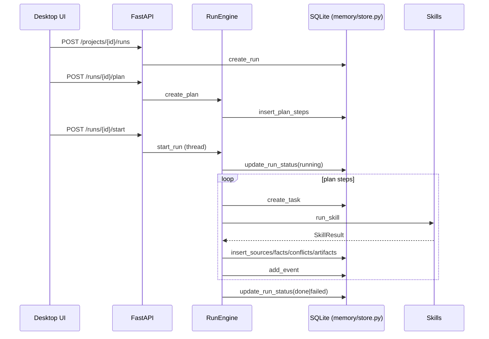

**A) Краткая сводка**
Randarc‑Astra сейчас — это локальная «станция» с UI‑оверлеем (Tauri + React), локальным API (FastAPI) и ядром, которое хранит состояния запусков (Run/Plan/Task/Event) в SQLite и оркестрирует навыки. Основной путь: UI создаёт Run, API строит план, ядро исполняет шаги навыков и пишет события, источники, факты и артефакты в БД/файлы. Кодовой точкой входа в API является `apps/api/main.py`, в UI — `apps/desktop/src/App.tsx`.

План по умолчанию в коде всегда содержит автопилот (`autopilot_computer`) и «memory_save» (`core/planner.py`), а сами навыки работают через локальный desktop‑bridge (`core/bridge/desktop_bridge.py` ↔ `apps/desktop/src-tauri/src/bridge.rs`). Ключи для LLM читаются из `config/local.secrets.json` или `.astra/vault.bin` (`core/secrets.py`).

Что точно работает:
- Локальный API с базовой авторизацией, CRUD по проектам и Run, выдача снапшота и экспорт JSON/NDJSON (`apps/api/routes/*.py`, `apps/api/auth.py`).
- SQLite‑хранилище и миграции (таблицы проектов/запусков/плана/задач/событий/артефактов/approvals) (`memory/db.py`, `memory/migrations/*.sql`).
- Пайплайн Run → Task с фиксацией событий в БД (кроме событий, запрещённых `core/event_bus.py`).
- UI‑HUD: создание Run, отображение плана/задач/событий, экспорт снапшота/отчёта, окно настроек (`apps/desktop/src/App.tsx`).
- Навыки `report`, `conflict_scan`, `memory_save` выполняются локально без внешних сервисов (`skills/report/skill.py`, `skills/conflict_scan/skill.py`, `skills/memory_save/skill.py`).

Что частично работает (с условиями):
- `web_research` работает полноценно только при наличии `search.provider=yandex` + `YANDEX_API_KEY` + `search_url` в `project.settings` (`core/providers/search_client.py`). Без этого работает только «stub» (извлекает URL из запроса, но без сниппетов, фактов может не быть).
- `extract_facts` требует LLM‑провайдера (OpenAI/Yandex/GigaChat) и секретов, иначе уходит в эвристику и даёт слабые результаты (`core/providers/llm_client.py`, `skills/extract_facts/skill.py`).
- `computer` и `shell` требуют запущенного desktop‑bridge и macOS‑разрешений; в противном случае будут 503 от bridge (`skills/computer/skill.py`, `skills/shell/skill.py`, `apps/desktop/src-tauri/src/bridge.rs`).
- Pause/Resume Run формально есть в API, но в реальности дают 500 из‑за запрета типов событий в `core/event_bus.py`.

Что не работает/не реализовано:
- Автопилот по умолчанию (`autopilot_computer`) ломается из‑за отсутствия типов событий `autopilot_state`/`autopilot_action` в `core/event_bus.py` (первый `emit(...)` бросает `ValueError`).
- События `run_paused`/`run_resumed` тоже запрещены `core/event_bus.py`, из‑за чего `POST /runs/{id}/pause` и `POST /runs/{id}/resume` дают 500, хотя статус в БД меняется.
- Реальная «развязка конфликтов» не реализована: `POST /runs/{id}/conflicts/{conflict_id}/resolve` создаёт новый Run, но без специального плана под конфликт (`apps/api/routes/runs.py`, `core/planner.py`).
- Keychain/системный «secure storage» для ключей не реализован (в коде только файл/ENV/зашифрованный vault, но без интеграции с Keychain).

**B) Архитектура (Run/Plan/Task/Event)**
Текущее описание сущностей (как реально в коде):
- Run: запуск запроса пользователя. Поля в БД: `runs.id`, `project_id`, `query_text`, `mode`, `status`, `created_at`, `started_at`, `finished_at`, `parent_run_id`, `purpose` (`memory/migrations/001_init.sql`, `002_approvals_fts.sql`).
- PlanStep: шаг плана, всегда создаётся заранее и хранит `skill_name`, `inputs`, `depends_on`, `status` (`memory/migrations/001_init.sql`, `memory/store.py`).
- Task: попытка выполнения шага плана, хранит `attempt`, `status`, `started_at`, `finished_at`, `error` (`memory/store.py`).
- Event: отдельная запись в журнале, хранится в `events` с полями `id`, `run_id`, `ts`, `type`, `level`, `message`, `payload`, `task_id`, `step_id` (`memory/store.py`).

Где они хранятся (таблицы/файлы):
- SQLite: `.astra/astra.db` (`memory/db.py`). Миграции: `memory/migrations/001_init.sql`, `002_approvals_fts.sql`, `003_approvals_decision.sql`. Фактически применены: `001_init.sql`, `002_approvals_fts.sql`, `003_approvals_decision.sql` (см. `schema_migrations` в `.astra/astra.db`).
- Файловые артефакты: `artifacts/<run_id>/...` (`skills/report/skill.py`, `skills/autopilot_computer/skill.py`).
- Логи: `.astra/logs` (создаются `scripts/run.sh`), публичная ссылка `logs` — это симлинк.

Как идёт поток: запрос → run → plan → tasks → events → artifacts
- UI создаёт Run (`POST /api/v1/projects/{project_id}/runs`) и план (`POST /api/v1/runs/{run_id}/plan`) (`apps/desktop/src/api.ts`).
- `RunEngine.start_run` берёт plan из БД и запускает шаги по порядку, игнорируя `depends_on` (нет логики ожидания зависимостей) (`core/run_engine.py`, `memory/store.py`).
- Для каждого шага создаётся Task, вызывается SkillRunner → навык → возвращается `SkillResult` (`core/skills/runner.py`, `core/skills/result_types.py`).
- `RunEngine._persist_skill_result` сохраняет Sources/Facts/Conflicts/Artifacts и пишет события через `core/event_bus.py` → `memory/store.py`.

Mermaid (sequence diagram):


Mermaid (component diagram):
```mermaid
graph LR
  UI[Desktop HUD (Tauri + React)] <--> API[FastAPI /api/v1]
  API <--> Core[RunEngine + Planner]
  Core <--> Skills[Python skills/*]
  Skills <--> Bridge[Desktop Bridge 127.0.0.1:43124]
  Bridge <--> Tauri[Tauri (Rust)]
  Core <--> DB[SQLite .astra/astra.db]
  Core <--> FS[artifacts/, config/]
```

**C) UI (HUD/desktop)**
Как выглядит окно: режимы, состояния
- Режимы окна: `window` (обычное окно) и `overlay` (оверлей, всегда поверх), переключение Cmd+Shift+O (`apps/desktop/src/App.tsx`, `apps/desktop/src-tauri/src/main.rs`).
- Состояния по данным: `idle` (нет активного Run), `active` (run.status = running/paused), `done` (done/failed/canceled). Внутри оверлея показывается `phase` из `autopilot_state`: `thinking`/`acting`, а также `waiting_confirm`/`needs_user` (если есть такие поля).
- UI метки: `waiting_confirm` отображается как «Ждёт подтверждение», `done` как «Готово», `idle` как «Ожидание» (`apps/desktop/src/App.tsx`).

Откуда UI берёт данные (эндпоинты/SSE):
- HTTP: `GET /api/v1/runs/{id}/snapshot` для полного состояния (run, plan, tasks, approvals, artifacts, metrics) (`apps/desktop/src/api.ts`).
- SSE: `GET /api/v1/runs/{id}/events?token=...` через `EventSource`, слушаются типы из `EVENT_TYPES` (`apps/desktop/src/App.tsx`).
- Дополнительно: `POST /api/v1/approvals/{id}/approve|reject`, `GET /api/v1/projects`, `POST /api/v1/projects`, `POST /api/v1/runs/{id}/start`, `POST /api/v1/runs/{id}/cancel` и т.д. (`apps/desktop/src/api.ts`).
- Разрешения macOS: Tauri‑команда `check_permissions` (`apps/desktop/src-tauri/src/main.rs`).

Главные файлы фронта и что в них:
- `apps/desktop/src/App.tsx` — вся логика HUD/настроек/событий, EventSource, вызовы API, состояние UI.
- `apps/desktop/src/api.ts` — клиент для API, токен‑bootstrap, EventSource URL.
- `apps/desktop/src/app.css` — стили HUD/overlay.
- `apps/desktop/src/main.tsx` — React‑bootstrap.
- `apps/desktop/src-tauri/src/main.rs` — команды Tauri, hotkeys, запуск bridge.

Известные проблемы UI (по коду):
- UI ждёт события `autopilot_state`/`autopilot_action`, но они не могут быть записаны из‑за ограничений `core/event_bus.py`. В итоге секции автопилота остаются пустыми.
- `pause/resume` в UI приводит к 500 на API (см. `core/event_bus.py`), поэтому «Пауза» фактически не работает.
- Нет автопереподключения SSE: при `onerror` лишь показывается сообщение, поток не восстанавливается (`apps/desktop/src/App.tsx`).
- `actions` из автопилота отображаются, но в overlay отображение ограничено `actionsLimit` (4/10), остальные теряются визуально (`apps/desktop/src/App.tsx`).
- В overlay‑режиме позиция/размер окна сохраняются в localStorage без проверки границ экрана. Возможна «пропажа» окна вне экрана при смене монитора (`apps/desktop/src/App.tsx`).

**D) API (FastAPI)**
Полный список роутов (группами) + коротко что делает каждый:
Требование авторизации:
- Все маршруты, кроме `/api/v1/auth/*`, требуют токен (`apps/api/auth.py`, `apps/api/routes/*.py`). Токен передаётся через `Authorization: Bearer <token>` или query `?token=`.
Группа `auth` (`apps/api/routes/auth.py`):
- `GET /api/v1/auth/status` — статус инициализации сессионного токена.
- `POST /api/v1/auth/bootstrap` — устанавливает токен (один раз).

Группа `projects` (`apps/api/routes/projects.py`):
- `POST /api/v1/projects` — создать проект, можно передать `settings`.
- `GET /api/v1/projects` — список проектов.
- `GET /api/v1/projects/{project_id}` — получить проект.
- `PUT /api/v1/projects/{project_id}` — обновить проект.
- `GET /api/v1/projects/{project_id}/memory/search` — полнотекстовый поиск по памяти (FTS или fallback LIKE).

Группа `runs` (`apps/api/routes/runs.py`):
- `POST /api/v1/projects/{project_id}/runs` — создать Run.
- `POST /api/v1/runs/{run_id}/plan` — создать план (сейчас всегда автопилот + memory_save).
- `POST /api/v1/runs/{run_id}/start` — старт Run (в отдельном потоке).
- `POST /api/v1/runs/{run_id}/cancel` — отмена.
- `POST /api/v1/runs/{run_id}/pause` — пауза (ломается из‑за event_bus).
- `POST /api/v1/runs/{run_id}/resume` — возобновление (ломается из‑за event_bus).
- `POST /api/v1/runs/{run_id}/tasks/{task_id}/retry` — повторить task.
- `POST /api/v1/runs/{run_id}/steps/{step_id}/retry` — повторить step.
- `GET /api/v1/runs/{run_id}` — получить Run.
- `GET /api/v1/runs/{run_id}/plan` — план Run.
- `GET /api/v1/runs/{run_id}/tasks` — задачи Run.
- `GET /api/v1/runs/{run_id}/sources` — источники.
- `GET /api/v1/runs/{run_id}/facts` — факты.
- `GET /api/v1/runs/{run_id}/conflicts` — конфликты.
- `GET /api/v1/runs/{run_id}/artifacts` — артефакты.
- `GET /api/v1/runs/{run_id}/snapshot` — агрегированный снимок.
- `GET /api/v1/runs/{run_id}/snapshot/download` — скачать JSON‑снимок.
- `GET /api/v1/runs/{run_id}/approvals` — список подтверждений.
- `POST /api/v1/approvals/{approval_id}/approve` — подтверждение.
- `POST /api/v1/approvals/{approval_id}/reject` — отклонение.
- `POST /api/v1/runs/{run_id}/conflicts/{conflict_id}/resolve` — создать sub‑run для разрешения (реального resolution‑плана нет).

Группа `events` (`apps/api/routes/run_events.py`):
- `GET /api/v1/runs/{run_id}/events` — SSE‑стрим событий.
- `GET /api/v1/runs/{run_id}/events/download` — NDJSON выгрузка событий.

Группа `skills` (`apps/api/routes/skills.py`):
- `GET /api/v1/skills` — список manifest.
- `GET /api/v1/skills/{skill_name}/manifest` — конкретный manifest.
- `POST /api/v1/skills/reload` — перезагрузка registry.

Группа `artifacts` (`apps/api/routes/artifacts.py`):
- `GET /api/v1/artifacts/{artifact_id}/download` — скачать файл артефакта.

Группа `secrets` (`apps/api/routes/secrets.py`):
- `POST /api/v1/secrets/unlock` — задать runtime‑passphrase.
- `POST /api/v1/secrets/openai` — задать runtime ключ (без сохранения на диск).
- `POST /api/v1/secrets/openai_local` — сохранить в `config/local.secrets.json` + runtime.
- `GET /api/v1/secrets/openai_local` — проверить, есть ли локальный ключ.
- `GET /api/v1/secrets/status` — status runtime‑passphrase.

Какие модели/схемы используются (Pydantic/JSON schemas):
- Pydantic: `apps/api/models.py` (`ProjectCreate`, `ProjectUpdate`, `RunCreate`, `BootstrapRequest`, `ApprovalDecision`).
- JSON Schemas: `schemas/*.schema.json` (run, plan_step, task, event, approval, source, fact, artifact, skill_manifest, skill_result). Навыки используют `schemas/skills/*.inputs.schema.json`.

Как устроен SSE поток событий и формат event:
- SSE формируется из `events` таблицы (`memory/store.py`) с `rowid` как `seq`.
- Клиент может передать `Last-Event-ID` или `last_event_id` (query).
- Формат:
```text
id: <seq>
event: <type>
data: {"id":...,"run_id":...,"type":...,"payload":...}
```
- Поля события: `id`, `run_id`, `ts`, `type`, `level`, `message`, `payload`, `task_id`, `step_id`, `seq` (`memory/store.py`, `schemas/event.schema.json`).

**E) Skills (навыки)**
Источник списка: директории `skills/*` + manifest в `skills/*/manifest.json`.

**autopilot_computer** (`skills/autopilot_computer/`)
- Назначение: автопилот «экран → LLM → действия → цикл».
- Входы/выходы: входы `schemas/skills/autopilot_computer.inputs.schema.json`, выход `schemas/skill_result.schema.json`, manifest `skills/autopilot_computer/manifest.json`.
- Side effects: управление мышью/клавиатурой, скриншоты, запись артефактов в `artifacts/<run_id>/`.
- Зависимости/провайдеры: LLM (`core/providers/llm_client.py`), desktop‑bridge (`core/bridge/desktop_bridge.py`), промт `prompts/autopilot_system.txt`.
- Какие события пишет: пытается писать `autopilot_state`, `autopilot_action`, `task_progress`, `approval_requested`/`approved`/`rejected` (`skills/autopilot_computer/skill.py`).
- Статус: не работает из‑за отсутствия `autopilot_state`/`autopilot_action` в `core/event_bus.py`. Дополнительно требует `run.mode` = `execute_confirm|autopilot_safe`.
- Мини‑пример вызова (payload):
```json
{"goal":"Открой браузер и перейди на example.com","max_cycles":5,"max_actions":3}
```

**computer** (`skills/computer/`)
- Назначение: выполнить явные действия ОС через desktop‑bridge.
- Входы/выходы: вход `schemas/skills/computer.inputs.schema.json` (поле `steps`), выход `schemas/skill_result.schema.json`, manifest `skills/computer/manifest.json`.
- Side effects: OS control (mouse/keyboard/screenshot) через bridge.
- Зависимости/провайдеры: desktop‑bridge на `127.0.0.1:${ASTRA_DESKTOP_BRIDGE_PORT}`.
- Какие события пишет: косвенно через `SkillResult.events` → `task_progress` (`core/run_engine.py`).
- Статус: частично работает. Требует mode `execute_confirm` и запущенный bridge. Вход `actions` не проходит валидацию схемы (schema принимает только `steps`).
- Мини‑пример вызова (payload):
```json
{"steps":[{"action":"left_click","coordinate":[640,360]}]}
```

**shell** (`skills/shell/`)
- Назначение: выполнить shell‑команду через bridge.
- Входы/выходы: `schemas/skills/shell.inputs.schema.json`, `schemas/skill_result.schema.json`, manifest `skills/shell/manifest.json`.
- Side effects: выполнение команд в ОС.
- Зависимости/провайдеры: desktop‑bridge; требует `execute_confirm`.
- Какие события пишет: через `SkillResult.events` → `task_progress`.
- Статус: частично работает. Поле `args` из схемы не используется в реализации (`skills/shell/skill.py`).
- Мини‑пример вызова (payload):
```json
{"command":"echo hello"}
```

**web_research** (`skills/web_research/`)
- Назначение: найти источники по запросу.
- Входы/выходы: `schemas/skills/web_research.inputs.schema.json`, `schemas/skill_result.schema.json`, manifest `skills/web_research/manifest.json`.
- Side effects: сеть.
- Зависимости/провайдеры: `search.provider=yandex` + `YANDEX_API_KEY` + `search_url` в `project.settings` (`core/providers/search_client.py`).
- Какие события пишет: источники сохраняются в БД, `source_found/source_fetched` генерируются `RunEngine`.
- Статус: частично работает без Yandex (stub возвращает URL без сниппетов → факты могут быть пустыми).
- Мини‑пример вызова (payload):
```json
{"query":"example.com"}
```

**extract_facts** (`skills/extract_facts/`)
- Назначение: извлечь факты из сниппетов источников.
- Входы/выходы: `schemas/skills/extract_facts.inputs.schema.json`, `schemas/skill_result.schema.json`, manifest `skills/extract_facts/manifest.json`.
- Side effects: нет.
- Зависимости/провайдеры: LLM (`openai|yandex|gigachat`), промт `prompts/extract_facts_system.txt`.
- Какие события пишет: `fact_extracted` через `RunEngine._persist_skill_result`.
- Статус: частично работает. Если нет сниппетов или LLM, факты могут быть пустыми.
- Мини‑пример вызова (payload):
```json
{"source_ids":["source-1","source-2"]}
```

**conflict_scan** (`skills/conflict_scan/`)
- Назначение: выявить конфликтующие факты.
- Входы/выходы: `schemas/skills/conflict_scan.inputs.schema.json`, `schemas/skill_result.schema.json`, manifest `skills/conflict_scan/manifest.json`.
- Side effects: нет.
- Зависимости/провайдеры: локальная БД (`memory/store.py`).
- Какие события пишет: `events` с `type=conflict`, далее `RunEngine` сохраняет в `conflicts` и пишет `conflict_detected`.
- Статус: работает.
- Мини‑пример вызова (payload):
```json
{}
```

**report** (`skills/report/`)
- Назначение: собрать markdown‑отчёт по источникам/фактам/конфликтам.
- Входы/выходы: `schemas/skills/report.inputs.schema.json`, `schemas/skill_result.schema.json`, manifest `skills/report/manifest.json`.
- Side effects: запись файла в `artifacts/<run_id>/report.md`.
- Зависимости/провайдеры: локальная БД, файловая система.
- Какие события пишет: `artifact_created` через `RunEngine`.
- Статус: работает.
- Мини‑пример вызова (payload):
```json
{"format":"markdown"}
```

**memory_save** (`skills/memory_save/`)
- Назначение: «сохранить в память» (фактически — сформировать событие о количестве результатов).
- Входы/выходы: `schemas/skills/memory_save.inputs.schema.json`, `schemas/skill_result.schema.json`, manifest `skills/memory_save/manifest.json`.
- Side effects: нет (данные уже в БД).
- Зависимости/провайдеры: локальная БД.
- Какие события пишет: `task_progress` (через `RunEngine`), с payload о количестве источников/фактов/артефактов.
- Статус: работает, но не делает реальную запись (только отчёт).
- Мини‑пример вызова (payload):
```json
{}
```

**F) Desktop bridge (Tauri/Rust)**
Какие команды/эндпоинты реально есть:
- `POST /computer/preview` — валидирует JSON, возвращает summary.
- `POST /computer/execute` — выполняет действия мыши/клавиатуры через `enigo`.
- `POST /shell/preview` — возвращает команду как output.
- `POST /shell/execute` — выполняет shell‑команду (`BashExecutor`).
- `POST /autopilot/capture` — скриншот и JPEG‑компрессия.
- `POST /autopilot/act` — исполнение одного действия автопилота.
- `GET /autopilot/permissions` — статус разрешений.

Что делает capture/act/permissions/computer/shell:
- `capture` — делает скриншот через `xcap`, масштабирует и возвращает `image_base64` + размеры (`apps/desktop/src-tauri/src/autopilot/screen.rs`).
- `act` — переводит координаты из изображения в экранные и выполняет input‑действия (`apps/desktop/src-tauri/src/autopilot/input.rs`).
- `permissions` — проверка наличия Screen Recording и Accessibility (упрощённая, через `xcap` и `enigo`) (`apps/desktop/src-tauri/src/autopilot/permissions.rs`).
- `computer` — набор действий (mouse/keyboard/screenshot) для явных команд (`apps/desktop/src-tauri/src/skills/computer.rs`).
- `shell` — выполняет команду в bash (`apps/desktop/src-tauri/src/skills/shell.rs`).

Какие macOS разрешения нужны:
- Screen Recording — для `xcap::Monitor::capture_image`.
- Accessibility — для `enigo` (управление клавиатурой/мышью).

Где лежит код и что ключевое:
- Tauri main: `apps/desktop/src-tauri/src/main.rs`.
- Bridge HTTP: `apps/desktop/src-tauri/src/bridge.rs`.
- Autopilot input/screen: `apps/desktop/src-tauri/src/autopilot/*.rs`.

**G) Хранилище и файлы**
Где база SQLite, какие миграции применены:
- База: `.astra/astra.db` (создаётся `memory/db.py`).
- Миграции: `memory/migrations/001_init.sql`, `002_approvals_fts.sql`, `003_approvals_decision.sql`.
- Применено в текущей базе: все три миграции (см. `schema_migrations` в `.astra/astra.db`).

Где артефакты, что в них:
- `artifacts/<run_id>/report.md` — отчёты (`skills/report/skill.py`).
- `artifacts/<run_id>/autopilot_log.json` и `autopilot_summary.md` — автопилот (при успешном выполнении) (`skills/autopilot_computer/skill.py`).

Где конфиги и env:
- `.env` (если есть) грузится в `scripts/run.sh` (файл в gitignore).
- `config/local.secrets.json` — локальный ключ (plaintext) (`core/secrets.py`).
- Переменные окружения: `ASTRA_BASE_DIR`, `ASTRA_DATA_DIR`, `ASTRA_VAULT_PATH`, `ASTRA_VAULT_PASSPHRASE`, `ASTRA_LOCAL_SECRETS_PATH`, `ASTRA_API_PORT`, `ASTRA_DESKTOP_BRIDGE_PORT`.

Что игнорится гитом:
- `.astra/`, `artifacts/`, `logs/`, `.venv/`, `node_modules/`, `dist/`, `config/*.secrets.json`, `.env*` (`.gitignore`).

**H) Секреты/Keychain/Vault**
Как сейчас хранится ключ модели:
- Runtime: в памяти процесса (`core/secrets.py`).
- Локально: `config/local.secrets.json` (plaintext).
- Vault: `.astra/vault.bin` с Argon2 + SecretBox (`memory/vault.py`), CLI — `apps/api/vault_cli.py`.
Keychain: не найдено (интеграции с системным Keychain в коде нет).

Почему могут появляться системные попапы:
- При первом доступе к Screen Recording и Accessibility macOS покажет системные запросы (используются `xcap`/`enigo`).

Что нужно сделать, чтобы “ввёл один раз и забыл”:
- Сейчас нет Keychain‑интеграции. Реальный «one‑time» возможен только через: 
- запись ключа в `config/local.secrets.json`, или
- использование vault + постоянное хранение `ASTRA_VAULT_PASSPHRASE` в окружении (например, через launchd).

Текущий статус:
- Не ок: нет безопасного «ввел и забыл» без plaintext или хранения passphrase в окружении. Keychain не реализован.

**I) Тесты**
Какие тесты есть, что покрывают:
- `tests/test_smoke.py` — сквозной тест API + планирование + события + артефакт (через stub‑bridge и ручной plan).
- `tests/test_planner.py` — план всегда начинается с `autopilot_computer`.
- `tests/test_approvals_decision.py` — сохранение `decision` в approvals.

Команды запуска:
- `python -m pytest` (требуется `requirements-dev.txt`).

Какие важные сценарии НЕ покрыты:
- Реальный автопилот (LLM + desktop‑bridge + события).
- UI (React/Tauri) и SSE reconnection.
- `pause/resume` и конфликт‑resolution.
- Хранилище секретов (vault unlock, local secrets).

**J) Как запустить и проверить (для меня одного)**
Пошагово: API, Desktop, тесты
1. `./scripts/run.sh` — поднимает API и Tauri dev (создаёт `.venv`, ставит deps, запускает `uvicorn`).
2. В UI открыть настройки (кнопка или Cmd+Shift+O → «Настройки»), сохранить ключ (сохраняется в `config/local.secrets.json`).
3. Ввести запрос в HUD и запустить Run.
4. Для тестов: `python -m pytest`.

Самый короткий smoke‑check сценарий:
1. `./scripts/run.sh`.
2. Открыть HUD → ввести «Проверь https://example.com». 
3. Убедиться, что Run создался, план появился, события идут, после завершения есть экспорт `report.md`.

Типичные ошибки и как чинить:
- Нет `node`/`cargo`: установить Node.js и Rust (сообщения `scripts/run.sh`).
- Ошибка разрешений macOS: открыть `scripts/permissions.sh` и выдать Screen Recording + Accessibility.
- API не отвечает: проверить `logs/api.log` (симлинк на `.astra/logs`).
- Desktop‑bridge 503: убедиться, что Tauri запущен и порт совпадает (`ASTRA_DESKTOP_BRIDGE_PORT`).
- `pause/resume` даёт 500: причина в `core/event_bus.py` (нет `run_paused`/`run_resumed`).

**K) Технический долг и план (по приоритетам)**
ТОП‑10 задач:
1. Добавить `autopilot_state`, `autopilot_action`, `run_paused`, `run_resumed` в `core/event_bus.py`.
2. Привести `schemas/event.schema.json` и `core/event_bus.py` к одному списку типов.
3. Исправить `autopilot_computer` запуск в режиме `research` или изменить default mode/plan.
4. Исправить несоответствие схемы `computer.inputs` (`steps` vs `actions`).
5. Добавить обработку `args` в `skills/shell/skill.py` или убрать из схемы.
6. Реализовать реальный resolution‑flow для конфликтов (отдельный план/skill).
7. Переподключение SSE в UI + индикаторы состояния потока.
8. Обновить `skills/memory_save` (либо реально писать «memory snapshot», либо переименовать).
9. Добавить Keychain‑интеграцию или безопасный секрет‑store.
10. Покрыть автопилот интеграционными тестами (LLM‑stub + bridge‑stub).

Риски:
- macOS permissions: доступ к Screen Recording/Accessibility может быть отклонён.
- Стабильность автопилота: без гарантированного подтверждения опасных действий возможны ложные клики.
- Селекторы/контекст: автопилот работает по скриншоту, ошибки распознавания вероятны.
- Сетевые зависимости: LLM и поисковые провайдеры дают нестабильные результаты/таймауты.

**Дерево проекта (эквивалент `tree -L 4`)**
```text
randarc-astra
├── apps
│   ├── __pycache__
│   │   └── __init__.cpython-311.pyc
│   ├── api
│   │   ├── __pycache__
│   │   │   ├── __init__.cpython-311.pyc
│   │   │   ├── auth.cpython-311.pyc
│   │   │   ├── config.cpython-311.pyc
│   │   │   ├── main.cpython-311.pyc
│   │   │   └── models.cpython-311.pyc
│   │   ├── routes
│   │   │   ├── __pycache__
│   │   │   ├── __init__.py
│   │   │   ├── artifacts.py
│   │   │   ├── auth.py
│   │   │   ├── projects.py
│   │   │   ├── run_events.py
│   │   │   ├── runs.py
│   │   │   ├── secrets.py
│   │   │   └── skills.py
│   │   ├── __init__.py
│   │   ├── auth.py
│   │   ├── config.py
│   │   ├── main.py
│   │   ├── models.py
│   │   ├── requirements.txt
│   │   └── vault_cli.py
│   ├── desktop
│   │   ├── dist
│   │   ├── node_modules
│   │   │   ├── @babel
│   │   │   ├── @esbuild
│   │   │   ├── @eslint
│   │   │   ├── @eslint-community
│   │   │   ├── @humanwhocodes
│   │   │   ├── @jridgewell
│   │   │   ├── @nodelib
│   │   │   ├── @rolldown
│   │   │   ├── @rollup
│   │   │   ├── @tauri-apps
│   │   │   ├── @types
│   │   │   ├── @typescript-eslint
│   │   │   ├── @ungap
│   │   │   ├── @vitejs
│   │   │   ├── acorn
│   │   │   ├── acorn-jsx
│   │   │   ├── ajv
│   │   │   ├── ansi-regex
│   │   │   ├── ansi-styles
│   │   │   ├── argparse
│   │   │   ├── array-buffer-byte-length
│   │   │   ├── array-includes
│   │   │   ├── array-union
│   │   │   ├── array.prototype.findlast
│   │   │   ├── array.prototype.flat
│   │   │   ├── array.prototype.flatmap
│   │   │   ├── array.prototype.tosorted
│   │   │   ├── arraybuffer.prototype.slice
│   │   │   ├── async-function
│   │   │   ├── available-typed-arrays
│   │   │   ├── balanced-match
│   │   │   ├── baseline-browser-mapping
│   │   │   ├── brace-expansion
│   │   │   ├── braces
│   │   │   ├── browserslist
│   │   │   ├── call-bind
│   │   │   ├── call-bind-apply-helpers
│   │   │   ├── call-bound
│   │   │   ├── callsites
│   │   │   ├── caniuse-lite
│   │   │   ├── chalk
│   │   │   ├── color-convert
│   │   │   ├── color-name
│   │   │   ├── concat-map
│   │   │   ├── convert-source-map
│   │   │   ├── cross-spawn
│   │   │   ├── data-view-buffer
│   │   │   ├── data-view-byte-length
│   │   │   ├── data-view-byte-offset
│   │   │   ├── debug
│   │   │   ├── deep-is
│   │   │   ├── define-data-property
│   │   │   ├── define-properties
│   │   │   ├── dir-glob
│   │   │   ├── doctrine
│   │   │   ├── dunder-proto
│   │   │   ├── electron-to-chromium
│   │   │   ├── es-abstract
│   │   │   ├── es-define-property
│   │   │   ├── es-errors
│   │   │   ├── es-iterator-helpers
│   │   │   ├── es-object-atoms
│   │   │   ├── es-set-tostringtag
│   │   │   ├── es-shim-unscopables
│   │   │   ├── es-to-primitive
│   │   │   ├── esbuild
│   │   │   ├── escalade
│   │   │   ├── escape-string-regexp
│   │   │   ├── eslint
│   │   │   ├── eslint-config-prettier
│   │   │   ├── eslint-plugin-react
│   │   │   ├── eslint-plugin-react-hooks
│   │   │   ├── eslint-scope
│   │   │   ├── eslint-visitor-keys
│   │   │   ├── espree
│   │   │   ├── esquery
│   │   │   ├── esrecurse
│   │   │   ├── estraverse
│   │   │   ├── esutils
│   │   │   ├── fast-deep-equal
│   │   │   ├── fast-glob
│   │   │   ├── fast-json-stable-stringify
│   │   │   ├── fast-levenshtein
│   │   │   ├── fastq
│   │   │   ├── file-entry-cache
│   │   │   ├── fill-range
│   │   │   ├── find-up
│   │   │   ├── flat-cache
│   │   │   ├── flatted
│   │   │   ├── for-each
│   │   │   ├── fs.realpath
│   │   │   ├── fsevents
│   │   │   ├── function-bind
│   │   │   ├── function.prototype.name
│   │   │   ├── functions-have-names
│   │   │   ├── generator-function
│   │   │   ├── gensync
│   │   │   ├── get-intrinsic
│   │   │   ├── get-proto
│   │   │   ├── get-symbol-description
│   │   │   ├── glob
│   │   │   ├── glob-parent
│   │   │   ├── globals
│   │   │   ├── globalthis
│   │   │   ├── globby
│   │   │   ├── gopd
│   │   │   ├── graphemer
│   │   │   ├── has-bigints
│   │   │   ├── has-flag
│   │   │   ├── has-property-descriptors
│   │   │   ├── has-proto
│   │   │   ├── has-symbols
│   │   │   ├── has-tostringtag
│   │   │   ├── hasown
│   │   │   ├── ignore
│   │   │   ├── import-fresh
│   │   │   ├── imurmurhash
│   │   │   ├── inflight
│   │   │   ├── inherits
│   │   │   ├── internal-slot
│   │   │   ├── is-array-buffer
│   │   │   ├── is-async-function
│   │   │   ├── is-bigint
│   │   │   ├── is-boolean-object
│   │   │   ├── is-callable
│   │   │   ├── is-core-module
│   │   │   ├── is-data-view
│   │   │   ├── is-date-object
│   │   │   ├── is-extglob
│   │   │   ├── is-finalizationregistry
│   │   │   ├── is-generator-function
│   │   │   ├── is-glob
│   │   │   ├── is-map
│   │   │   ├── is-negative-zero
│   │   │   ├── is-number
│   │   │   ├── is-number-object
│   │   │   ├── is-path-inside
│   │   │   ├── is-regex
│   │   │   ├── is-set
│   │   │   ├── is-shared-array-buffer
│   │   │   ├── is-string
│   │   │   ├── is-symbol
│   │   │   ├── is-typed-array
│   │   │   ├── is-weakmap
│   │   │   ├── is-weakref
│   │   │   ├── is-weakset
│   │   │   ├── isarray
│   │   │   ├── isexe
│   │   │   ├── iterator.prototype
│   │   │   ├── js-tokens
│   │   │   ├── js-yaml
│   │   │   ├── jsesc
│   │   │   ├── json-buffer
│   │   │   ├── json-schema-traverse
│   │   │   ├── json-stable-stringify-without-jsonify
│   │   │   ├── json5
│   │   │   ├── jsx-ast-utils
│   │   │   ├── keyv
│   │   │   ├── levn
│   │   │   ├── locate-path
│   │   │   ├── lodash.merge
│   │   │   ├── loose-envify
│   │   │   ├── lru-cache
│   │   │   ├── math-intrinsics
│   │   │   ├── merge2
│   │   │   ├── micromatch
│   │   │   ├── minimatch
│   │   │   ├── ms
│   │   │   ├── nanoid
│   │   │   ├── natural-compare
│   │   │   ├── node-releases
│   │   │   ├── object-assign
│   │   │   ├── object-inspect
│   │   │   ├── object-keys
│   │   │   ├── object.assign
│   │   │   ├── object.entries
│   │   │   ├── object.fromentries
│   │   │   ├── object.values
│   │   │   ├── once
│   │   │   ├── optionator
│   │   │   ├── own-keys
│   │   │   ├── p-limit
│   │   │   ├── p-locate
│   │   │   ├── parent-module
│   │   │   ├── path-exists
│   │   │   ├── path-is-absolute
│   │   │   ├── path-key
│   │   │   ├── path-parse
│   │   │   ├── path-type
│   │   │   ├── picocolors
│   │   │   ├── picomatch
│   │   │   ├── possible-typed-array-names
│   │   │   ├── postcss
│   │   │   ├── prelude-ls
│   │   │   ├── prettier
│   │   │   ├── prop-types
│   │   │   ├── punycode
│   │   │   ├── queue-microtask
│   │   │   ├── react
│   │   │   ├── react-dom
│   │   │   ├── react-is
│   │   │   ├── react-refresh
│   │   │   ├── reflect.getprototypeof
│   │   │   ├── regexp.prototype.flags
│   │   │   ├── resolve
│   │   │   ├── resolve-from
│   │   │   ├── reusify
│   │   │   ├── rimraf
│   │   │   ├── rollup
│   │   │   ├── run-parallel
│   │   │   ├── safe-array-concat
│   │   │   ├── safe-push-apply
│   │   │   ├── safe-regex-test
│   │   │   ├── scheduler
│   │   │   ├── semver
│   │   │   ├── set-function-length
│   │   │   ├── set-function-name
│   │   │   ├── set-proto
│   │   │   ├── shebang-command
│   │   │   ├── shebang-regex
│   │   │   ├── side-channel
│   │   │   ├── side-channel-list
│   │   │   ├── side-channel-map
│   │   │   ├── side-channel-weakmap
│   │   │   ├── slash
│   │   │   ├── source-map-js
│   │   │   ├── stop-iteration-iterator
│   │   │   ├── string.prototype.matchall
│   │   │   ├── string.prototype.repeat
│   │   │   ├── string.prototype.trim
│   │   │   ├── string.prototype.trimend
│   │   │   ├── string.prototype.trimstart
│   │   │   ├── strip-ansi
│   │   │   ├── strip-json-comments
│   │   │   ├── supports-color
│   │   │   ├── supports-preserve-symlinks-flag
│   │   │   ├── text-table
│   │   │   ├── to-regex-range
│   │   │   ├── ts-api-utils
│   │   │   ├── type-check
│   │   │   ├── type-fest
│   │   │   ├── typed-array-buffer
│   │   │   ├── typed-array-byte-length
│   │   │   ├── typed-array-byte-offset
│   │   │   ├── typed-array-length
│   │   │   ├── typescript
│   │   │   ├── unbox-primitive
│   │   │   ├── update-browserslist-db
│   │   │   ├── uri-js
│   │   │   ├── vite
│   │   │   ├── which
│   │   │   ├── which-boxed-primitive
│   │   │   ├── which-builtin-type
│   │   │   ├── which-collection
│   │   │   ├── which-typed-array
│   │   │   ├── word-wrap
│   │   │   ├── wrappy
│   │   │   ├── yallist
│   │   │   └── yocto-queue
│   │   ├── src
│   │   │   ├── i18n
│   │   │   ├── api.ts
│   │   │   ├── app.css
│   │   │   ├── App.tsx
│   │   │   └── main.tsx
│   │   ├── src-tauri
│   │   │   ├── icons
│   │   │   ├── src
│   │   │   ├── target
│   │   │   ├── build.rs
│   │   │   ├── Cargo.lock
│   │   │   ├── Cargo.toml
│   │   │   └── tauri.conf.json
│   │   ├── index.html
│   │   ├── package-lock.json
│   │   ├── package.json
│   │   ├── tsconfig.json
│   │   ├── tsconfig.node.json
│   │   └── vite.config.ts
│   └── __init__.py
├── artifacts
│   ├── 1d19ea3f-c7ae-4f3c-9337-0afc01a93536
│   │   └── report.md
│   ├── 1e637b1c-813f-4e07-864e-df75245956a4
│   │   └── report.md
│   ├── a4774925-9345-46f5-bace-d8ddd734ba22
│   │   └── report.md
│   └── da33f4ae-9f00-4fff-8264-8702ac5110fb
│       └── report.md
├── config
│   └── local.secrets.json
├── core
│   ├── __pycache__
│   │   ├── __init__.cpython-311.pyc
│   │   ├── event_bus.cpython-311.pyc
│   │   ├── planner.cpython-311.pyc
│   │   ├── run_engine.cpython-311.pyc
│   │   ├── secrets.cpython-311.pyc
│   │   └── skill_context.cpython-311.pyc
│   ├── bridge
│   │   ├── __pycache__
│   │   │   ├── __init__.cpython-311.pyc
│   │   │   └── desktop_bridge.cpython-311.pyc
│   │   ├── __init__.py
│   │   └── desktop_bridge.py
│   ├── providers
│   │   ├── __pycache__
│   │   │   ├── __init__.cpython-311.pyc
│   │   │   ├── llm_client.cpython-311.pyc
│   │   │   └── search_client.cpython-311.pyc
│   │   ├── __init__.py
│   │   ├── llm_client.py
│   │   └── search_client.py
│   ├── skills
│   │   ├── __pycache__
│   │   │   ├── __init__.cpython-311.pyc
│   │   │   ├── base.cpython-311.pyc
│   │   │   ├── registry.cpython-311.pyc
│   │   │   ├── result_types.cpython-311.pyc
│   │   │   ├── runner.cpython-311.pyc
│   │   │   └── schemas.cpython-311.pyc
│   │   ├── __init__.py
│   │   ├── base.py
│   │   ├── registry.py
│   │   ├── result_types.py
│   │   ├── runner.py
│   │   └── schemas.py
│   ├── __init__.py
│   ├── event_bus.py
│   ├── planner.py
│   ├── run_engine.py
│   ├── secrets.py
│   └── skill_context.py
├── docs
│   ├── analysis
│   │   ├── INVENTORY.md
│   │   └── REPO_VERDICT.md
│   ├── media
│   ├── API.md
│   ├── ARCHITECTURE.md
│   ├── DEVELOPMENT.md
│   ├── FRONTEND_BACKEND_OVERVIEW.md
│   ├── SECURITY.md
│   ├── SKILLS.md
│   └── STATE_OF_PROJECT.md
├── LEGAL
│   └── THIRD_PARTY_NOTICES.md
├── logs
│   ├── api.log
│   └── tauri.log
├── memory
│   ├── __pycache__
│   │   ├── db.cpython-311.pyc
│   │   ├── store.cpython-311.pyc
│   │   └── vault.cpython-311.pyc
│   ├── migrations
│   │   ├── 001_init.sql
│   │   ├── 002_approvals_fts.sql
│   │   └── 003_approvals_decision.sql
│   ├── db.py
│   ├── store.py
│   └── vault.py
├── prompts
│   ├── autopilot_system.txt
│   └── extract_facts_system.txt
├── schemas
│   ├── autopilot
│   │   ├── action.schema.json
│   │   └── protocol.schema.json
│   ├── events
│   │   ├── approval_approved.schema.json
│   │   ├── approval_rejected.schema.json
│   │   ├── approval_requested.schema.json
│   │   ├── artifact_created.schema.json
│   │   ├── autopilot_action.schema.json
│   │   ├── autopilot_state.schema.json
│   │   ├── conflict_detected.schema.json
│   │   ├── fact_extracted.schema.json
│   │   ├── plan_created.schema.json
│   │   ├── run_canceled.schema.json
│   │   ├── run_created.schema.json
│   │   ├── run_done.schema.json
│   │   ├── run_failed.schema.json
│   │   ├── run_paused.schema.json
│   │   ├── run_resumed.schema.json
│   │   ├── run_started.schema.json
│   │   ├── source_fetched.schema.json
│   │   ├── source_found.schema.json
│   │   ├── task_done.schema.json
│   │   ├── task_failed.schema.json
│   │   ├── task_progress.schema.json
│   │   ├── task_queued.schema.json
│   │   ├── task_retried.schema.json
│   │   ├── task_started.schema.json
│   │   └── verification_done.schema.json
│   ├── skills
│   │   ├── autopilot_computer.inputs.schema.json
│   │   ├── computer.inputs.schema.json
│   │   ├── conflict_scan.inputs.schema.json
│   │   ├── extract_facts.inputs.schema.json
│   │   ├── memory_save.inputs.schema.json
│   │   ├── report.inputs.schema.json
│   │   ├── shell.inputs.schema.json
│   │   └── web_research.inputs.schema.json
│   ├── approval.schema.json
│   ├── artifact.schema.json
│   ├── conflict.schema.json
│   ├── event.schema.json
│   ├── fact.schema.json
│   ├── plan_step.schema.json
│   ├── project.schema.json
│   ├── run.schema.json
│   ├── skill_manifest.schema.json
│   ├── skill_result.schema.json
│   ├── source.schema.json
│   └── task.schema.json
├── scripts
│   ├── install_launchd.sh
│   ├── permissions.sh
│   ├── run.sh
│   ├── set_openai_key.sh
│   ├── stop.sh
│   └── uninstall_launchd.sh
├── skills
│   ├── __pycache__
│   │   └── __init__.cpython-311.pyc
│   ├── autopilot_computer
│   │   ├── __pycache__
│   │   │   └── skill.cpython-311.pyc
│   │   ├── manifest.json
│   │   └── skill.py
│   ├── computer
│   │   ├── __init__.py
│   │   ├── manifest.json
│   │   └── skill.py
│   ├── conflict_scan
│   │   ├── __pycache__
│   │   │   ├── __init__.cpython-311.pyc
│   │   │   └── skill.cpython-311.pyc
│   │   ├── __init__.py
│   │   ├── manifest.json
│   │   └── skill.py
│   ├── extract_facts
│   │   ├── __pycache__
│   │   │   ├── __init__.cpython-311.pyc
│   │   │   └── skill.cpython-311.pyc
│   │   ├── __init__.py
│   │   ├── manifest.json
│   │   └── skill.py
│   ├── memory_save
│   │   ├── __pycache__
│   │   │   ├── __init__.cpython-311.pyc
│   │   │   └── skill.cpython-311.pyc
│   │   ├── __init__.py
│   │   ├── manifest.json
│   │   └── skill.py
│   ├── registry
│   │   └── registry.json
│   ├── report
│   │   ├── __pycache__
│   │   │   ├── __init__.cpython-311.pyc
│   │   │   └── skill.cpython-311.pyc
│   │   ├── __init__.py
│   │   ├── manifest.json
│   │   └── skill.py
│   ├── shell
│   │   ├── __pycache__
│   │   │   ├── __init__.cpython-311.pyc
│   │   │   └── skill.cpython-311.pyc
│   │   ├── __init__.py
│   │   ├── manifest.json
│   │   └── skill.py
│   ├── web_research
│   │   ├── __pycache__
│   │   │   ├── __init__.cpython-311.pyc
│   │   │   └── skill.cpython-311.pyc
│   │   ├── __init__.py
│   │   ├── manifest.json
│   │   └── skill.py
│   └── __init__.py
├── tests
│   ├── __pycache__
│   │   ├── test_approvals_decision.cpython-311-pytest-8.0.0.pyc
│   │   ├── test_planner.cpython-311-pytest-8.0.0.pyc
│   │   ├── test_smoke.cpython-311-pytest-8.0.0.pyc
│   │   └── test_yandex_music_skill.cpython-311-pytest-8.0.0.pyc
│   ├── test_approvals_decision.py
│   ├── test_planner.py
│   └── test_smoke.py
├── third_party
│   └── _donors
│       ├── Auto-Claude
│       │   ├── apps
│       │   ├── guides
│       │   ├── run.py
│       │   ├── scripts
│       │   ├── tests
│       │   ├── card_data.txt
│       │   ├── CHANGELOG.md
│       │   ├── CLA.md
│       │   ├── CLAUDE.md
│       │   ├── CONTRIBUTING.md
│       │   ├── LICENSE
│       │   ├── package-lock.json
│       │   ├── package.json
│       │   ├── pnpm-lock.yaml
│       │   ├── README.md
│       │   ├── RELEASE.md
│       │   └── ruff.toml
│       ├── computer-agent
│       │   ├── public
│       │   ├── src
│       │   ├── src-tauri
│       │   ├── index.html
│       │   ├── LICENSE
│       │   ├── package-lock.json
│       │   ├── package.json
│       │   ├── postcss.config.js
│       │   ├── README.md
│       │   ├── tailwind.config.js
│       │   ├── tsconfig.json
│       │   ├── tsconfig.node.json
│       │   └── vite.config.ts
│       ├── DeepAnalyze
│       │   ├── API
│       │   ├── assets
│       │   ├── deepanalyze
│       │   ├── demo
│       │   ├── docker
│       │   ├── docs
│       │   ├── example
│       │   ├── playground
│       │   ├── scripts
│       │   ├── CONTRIBUTION.md
│       │   ├── deepanalyze.py
│       │   ├── LICENSE
│       │   ├── quantize.py
│       │   ├── README.md
│       │   ├── requirements.txt
│       │   └── run.py
│       ├── Open-Interface
│       │   ├── app
│       │   ├── assets
│       │   ├── tests
│       │   ├── build.py
│       │   ├── LICENSE.md
│       │   ├── MEDIA.md
│       │   ├── README.md
│       │   └── requirements.txt
│       └── valuecell
│           ├── assets
│           ├── docker
│           ├── docs
│           ├── frontend
│           ├── python
│           ├── AGENTS.md
│           ├── LICENSE
│           ├── Makefile
│           ├── project.code-workspace
│           ├── README.ja.md
│           ├── README.md
│           ├── README.zh.md
│           ├── README.zh_Hant.md
│           ├── SECURITY.md
│           ├── start.ps1
│           └── start.sh
├── pytest.ini
├── README.md
├── README_PERSONAL.md
├── requirements-dev.txt
└── ruff.toml
```

Краткий вердикт (мусор vs ядро):
- Ядро: `core/`, `memory/`, `apps/api/`, `skills/`, `schemas/`, `apps/desktop/src`, `apps/desktop/src-tauri`.
- Мусор/генерёнка: `node_modules/`, `dist/`, `__pycache__/`, `.astra/`, `artifacts/`, `logs/`, `apps/desktop/src-tauri/target/`.
- Доноры/справочное: `third_party/_donors/`.

**Изменения в этом прогоне (fix/blockers)**
- Обновлён `core/event_bus.py`: список типов берётся из `schemas/events/*.schema.json`, добавлены `autopilot_state`, `autopilot_action`, `run_paused`, `run_resumed`.
- Синхронизирован `schemas/event.schema.json`: enum берётся из файлов событий, payload допускает `null`.
- Приведён `skills/computer/skill.py` к контракту `steps` (schema не менялась).
- Обновлён `.gitignore` для явного игнора `**/__pycache__/`, `**/*.pyc`, `**/.pytest_cache/`.
- Добавлены тесты: `tests/test_event_types_sync.py`, `tests/test_autopilot_events.py`, `tests/test_computer_skill_schema.py`.

Как проверить:
1. `pytest -q`
2. Ручной запуск UI:
   - `./scripts/run.sh`
   - В HUD запусти задачу (режим `execute_confirm`).
   - В журнале событий должны появляться `autopilot_state` и `autopilot_action` (если автопилот сделал хотя бы одно действие).
3. Проверка pause/resume:
   - Через UI нажми паузу/возобновление или вызови API `POST /api/v1/runs/{id}/pause` и `POST /api/v1/runs/{id}/resume`.
   - Убедись, что API отвечает 200 и в событиях есть `run_paused`/`run_resumed`.

